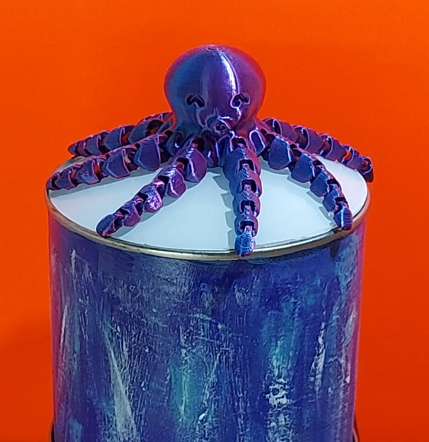
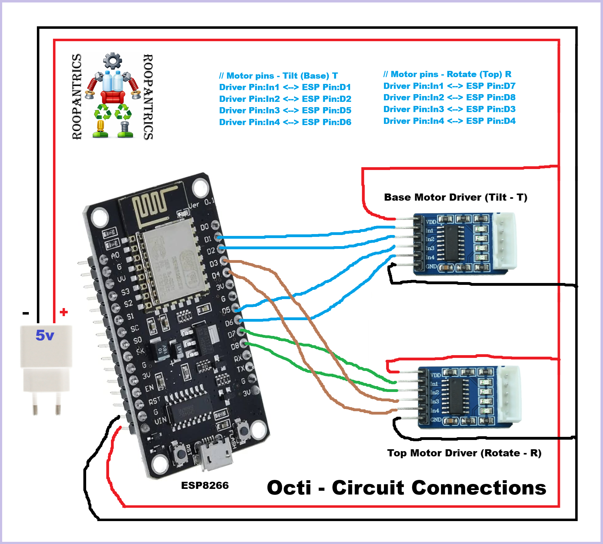

# Octi – Animated Octopus

Octi is an animated creature built using a combination of
mechanics, electronics, and repurposed household scrap.

This project is not just a “best out of waste” build —
it is an exercise in engineering thinking, motion design,
and problem-solving.

---

## Meet Octi

---

## 🎬 Project Video

Watch Octi in action on YouTube:  
https://www.youtube.com/watch?v=GHYv1o_LDxk

---

## Philosophy

**Engineering.**  
**Mechanics at the core.**  
**Powered by electronics.**  
**Crafted by scrap.**

---

## Hardware Used (Purchased)

- NodeMCU ESP8266 (CH340)
- 28BYJ-48 Stepper Motor + ULN2003 Driver × 2
- 3D Printed Flexible Octopus (outer form)

> All other mechanical structures, linkages, and casing were
> repurposed from household scrap materials.

---

## Approximate Cost (INR)

| Item | Quantity | Cost (₹) |
|-----|---------|----------|
| 28BYJ-48 Stepper Motor + ULN2003 Stepper Motor Driver | 2 | 119 |
| NodeMCU ESP8266 | 1 | 189 |
| 3D Printed Octopus | 1 | 224 |
| **Total** |  | **~651** |

---

## Pin Connections

### Tilt Motor (Base)
- IN1 → D1
- IN2 → D2
- IN3 → D5
- IN4 → D6

### Rotate Motor (Top)
- IN1 → D7
- IN2 → D8
- IN3 → D3
- IN4 → D4

---

## Connection Diagram

The complete control logic is available in oct.cpp file

---

## Using the Code

1. Download or clone this repository
2. Open Arduino IDE
3. Create a new sketch named `octi`
4. Copy the contents of `code/octi.cpp` into the sketch
5. Select **NodeMCU ESP8266** as the board
6. Upload
